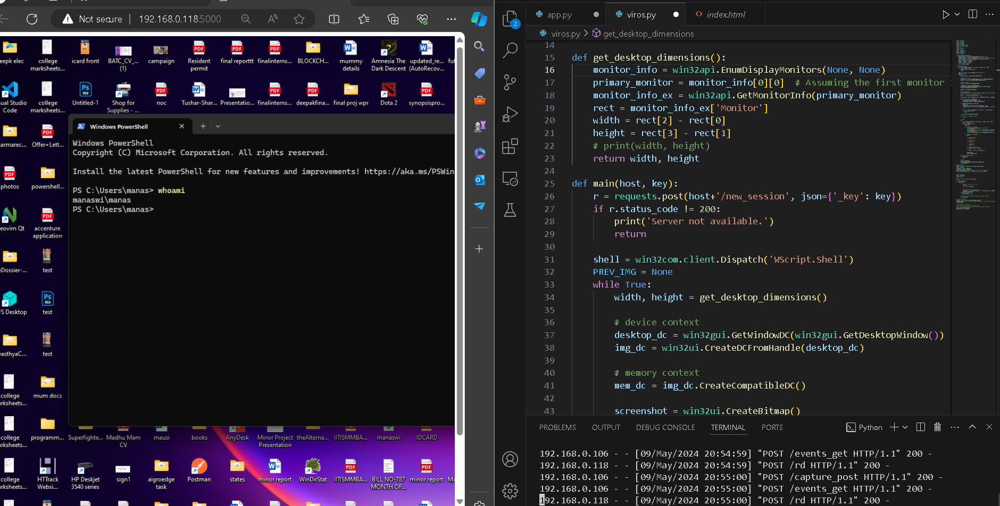

# PEEK-A-BOO
A Persistence maintaining backdoor which gives live screen sharing and remote desktop access with mouse clicks and keyboard strokes accessability

`----------------------------------------------------------------------------` 
 
`SETUP: -`

Install `virus.py` in the target pc and preferably store it in the startup folder of the target pc for easy future access.

APP.PY - 
Run `flask run -h <your url>` to start the server and you will start seeing usernames of the PC's in which the virus is installed.
Open the flask server and you will be prompted for a key in which you will insert the username of the pc you want to connect to.

The live screen will start displaying in your browser 
  
